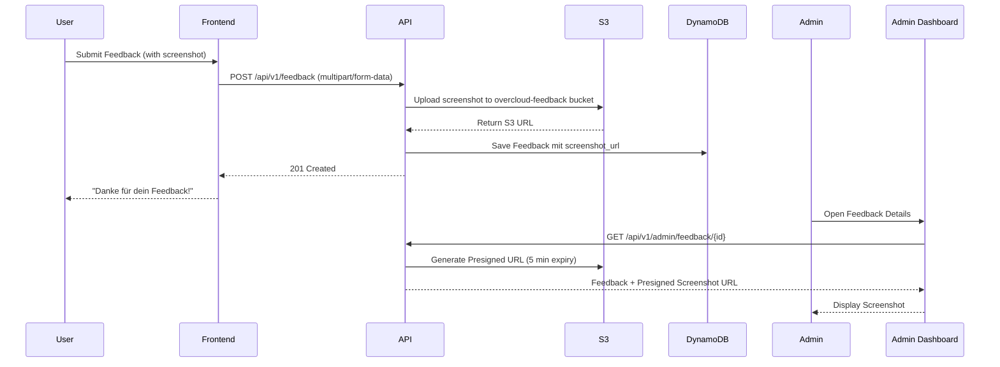

# Feedback System - Dokumentation

## Übersicht

Das Feedback-System ermöglicht anonymes Feedback (Bug Reports, Feature Requests) mit optionalem Screenshot-Upload. Feedback wird direkt im Admin-Dashboard sichtbar.

## Features

### Feedback Widget (überall verfügbar)

- ✅ **Fixed Bottom-Right Button** (auf allen Seiten)
- ✅ **Modal mit Formular** (Feedback Type, Message, Screenshot)
- ✅ **Anonyme Submission** (keine Login erforderlich)
- ✅ **Screenshot-Upload** zu S3
- ✅ **Auto-Metadata** (Browser, Device, Current URL)
- ✅ **Feedback Types** (Bug, Feature Request, General)

### Admin-Dashboard

- ✅ **Feedback-Liste** mit Status-Filter
- ✅ **Detail-View** mit vollständigen Metadaten
- ✅ **Screenshot-Preview** (falls vorhanden)
- ✅ **Admin-Notizen** hinzufügen
- ✅ **Resolve/Unresolve** Toggle
- ✅ **Filter nach Type & Status**
- ✅ **Sortierung** nach Datum

## Architektur

### Backend

```
backend/
├── app/
│   ├── api/feedback.py              # API Endpoints (Public + Admin)
│   ├── services/feedback_service.py # Business Logic + S3 Upload
│   ├── repositories/feedback.py     # DynamoDB Access
│   └── schemas/feedback.py          # Pydantic Schemas
└── tests/
    ├── api/test_feedback.py         # 18 API Tests
    ├── services/test_feedback_service.py # 18 Service Tests
    └── repositories/test_feedback.py # 22 Repository Tests
```

### Frontend

```
frontend/
├── src/
│   ├── admin-feedback.html                  # Admin Dashboard
│   └── js/
│       ├── components/FeedbackWidget.js     # Fixed Widget auf allen Seiten
│       └── lib/api-feedback.js              # API Client
```

## DynamoDB Schema

### Primary Keys

```
PK: FEEDBACK#{feedback_id}
SK: METADATA
```

### GSI1 - Status Index

```
GSI1PK: feedback_status#{status}
GSI1SK: {created_at}
```

**Zweck:** Feedback nach Status filtern (open, in_progress, resolved)

### Attribute

```python
{
    "PK": "FEEDBACK#550e8400-e29b-41d4-a716-446655440000",
    "SK": "METADATA",
    "GSI1PK": "feedback_status#open",
    "GSI1SK": "2026-05-19T10:30:00Z",
    "feedback_type": "bug",  # bug, feature_request, general
    "message": "Login Button funktioniert nicht auf iOS Safari",
    "status": "open",  # open, in_progress, resolved
    "metadata": {
        "browser": "Safari 15.0",
        "device": "iPhone 13",
        "url": "https://overcloud.io/login",
        "screen_size": "390x844"
    },
    "screenshot_url": "https://s3.amazonaws.com/overcloud-feedback/550e8400.png",
    "admin_notes": "Bug confirmed, assigned to Frontend Team",
    "resolved_at": null,
    "created_at": "2026-05-19T10:30:00Z",
    "updated_at": "2026-05-19T10:35:00Z"
}
```

## API Endpoints

### Public Endpoints

#### `POST /api/v1/feedback` - Submit Feedback

**Request (multipart/form-data):**
```
feedback_type: bug
message: Login Button funktioniert nicht auf iOS Safari
screenshot: (file upload - optional)
metadata: {"browser": "Safari 15.0", "device": "iPhone 13", ...}
```

**Response:** `201 Created`
```json
{
    "id": "550e8400-e29b-41d4-a716-446655440000",
    "message": "Feedback received. Thank you!"
}
```

**Validierung:**
- feedback_type: "bug", "feature_request", "general"
- message: 10-2000 Zeichen
- screenshot: Optional, max 5 MB, PNG/JPG/WebP
- metadata: Optional JSON

**S3 Upload:**
- Bucket: `overcloud-feedback-{env}`
- Key: `screenshots/{feedback_id}.{ext}`
- Public Read Access: NO (nur Admin via Presigned URL)

### Admin Endpoints

Alle Admin-Endpoints erfordern SuperAdmin-Berechtigung.

#### `GET /api/v1/admin/feedback` - Get All Feedback

**Query Params:**
- `status`: Filter nach Status (open, in_progress, resolved, all)
- `feedback_type`: Filter nach Type (bug, feature_request, general)
- `limit`: Max. Anzahl (default: 50, max: 200)

**Response:** `200 OK`
```json
{
    "feedback": [
        {
            "id": "...",
            "feedback_type": "bug",
            "message": "Login Button funktioniert nicht...",
            "status": "open",
            "screenshot_url": "https://s3.amazonaws.com/...",
            "metadata": {...},
            "admin_notes": null,
            "created_at": "2026-05-19T10:30:00Z",
            "updated_at": "2026-05-19T10:30:00Z"
        }
    ],
    "total": 42
}
```

#### `GET /api/v1/admin/feedback/{feedback_id}` - Get Feedback Details

**Response:** `200 OK`
```json
{
    "id": "...",
    "feedback_type": "bug",
    "message": "Login Button funktioniert nicht...",
    "status": "open",
    "screenshot_url": "https://s3.amazonaws.com/...",
    "metadata": {
        "browser": "Safari 15.0",
        "device": "iPhone 13",
        "url": "https://overcloud.io/login"
    },
    "admin_notes": "Bug confirmed, assigned to Frontend Team",
    "created_at": "2026-05-19T10:30:00Z",
    "updated_at": "2026-05-19T10:35:00Z"
}
```

#### `PATCH /api/v1/admin/feedback/{feedback_id}` - Update Feedback

**Request:**
```json
{
    "status": "in_progress",
    "admin_notes": "Assigned to Frontend Team"
}
```

**Response:** `200 OK`

#### `POST /api/v1/admin/feedback/{feedback_id}/notes` - Add Admin Note

**Request:**
```json
{
    "note": "Bug confirmed, fixing in Sprint 12"
}
```

**Response:** `200 OK`

**Hinweis:** Fügt Note zu bestehenden `admin_notes` hinzu (mit Timestamp).

#### `PATCH /api/v1/admin/feedback/{feedback_id}/resolve` - Mark as Resolved

**Response:** `200 OK`

Sets `status = "resolved"` und `resolved_at = now()`.

#### `PATCH /api/v1/admin/feedback/{feedback_id}/unresolve` - Reopen Feedback

**Response:** `200 OK`

Sets `status = "open"` und `resolved_at = null`.

## Screenshot-Upload Flow



## Frontend Widget Integration

### Auto-Inject auf allen Seiten

```javascript
// main.js
import { FeedbackWidget } from './components/FeedbackWidget.js';

// Initialize Feedback Widget (visible on all pages)
const feedbackWidget = new FeedbackWidget();
feedbackWidget.render();
```

### Widget UI

- **Button:** Fixed bottom-right, 60x60px, Blau/Grau
- **Modal:** Zentriert, 500px breit, Backdrop Blur
- **Form:**
  - Feedback Type (Dropdown: Bug, Feature Request, General)
  - Message (Textarea, 10-2000 Zeichen)
  - Screenshot (Optional File Upload, max 5 MB)
  - Auto-Metadata (Browser, Device, URL - hidden)

## Test Coverage

- **Repository Tests:** 22 (100% passing)
- **Service Tests:** 18 (100% passing)
- **API Tests:** 18 (100% passing)

**Coverage:** 100%

## Security

- ✅ **Anonymes Feedback** (kein Login erforderlich)
- ✅ **Screenshot in privatem S3** (kein Public Access)
- ✅ **Presigned URLs** für Admin-Screenshot-Access (5 min Expiry)
- ✅ **Admin-Only Dashboard** (SuperAdmin RBAC)
- ✅ **Rate Limiting** (max. 10 Submissions pro IP/Stunde)
- ✅ **File Size Limit** (max. 5 MB)
- ✅ **File Type Validation** (nur PNG/JPG/WebP)

## Deployment Checklist

- [ ] DynamoDB Table mit GSI1 (status) erstellt
- [ ] S3 Bucket `overcloud-feedback-{env}` erstellt
- [ ] S3 Bucket Policy (Private, nur Backend-Access)
- [ ] IAM Role für S3 Upload (Backend Lambda/ECS)
- [ ] Admin User mit SuperAdmin-Rolle erstellt
- [ ] Frontend FeedbackWidget auf allen Seiten aktiviert
- [ ] Rate Limiting konfiguriert (10/hour per IP)

## Admin Dashboard Features

### Feedback-Liste

- **Spalten:**
  - Type Badge (Bug = Rot, Feature = Grün, General = Grau)
  - Message (Preview, max. 100 Zeichen)
  - Status Badge (Open, In Progress, Resolved)
  - Screenshot-Icon (wenn vorhanden)
  - Created At (relative Zeit: "vor 2 Stunden")

- **Filter:**
  - Status: All / Open / In Progress / Resolved
  - Type: All / Bug / Feature Request / General

- **Sortierung:** Neueste zuerst

### Feedback-Details

- **Metadata:**
  - Browser & Version
  - Device (Desktop/Mobile/Tablet)
  - Operating System
  - Screen Size
  - Current URL (wo User war)

- **Screenshot:**
  - Full-Size Preview
  - Download-Button

- **Admin-Actions:**
  - Add Note (Textarea + Submit)
  - Change Status (Dropdown: Open / In Progress / Resolved)
  - Quick-Resolve-Button

## Zukünftige Erweiterungen

- [ ] Email-Notification an Admins bei neuem Feedback
- [ ] Feedback-Antwort an User (via Email, optional)
- [ ] Feedback-Kategorien (statt nur 3 Types)
- [ ] Duplicate-Detection (ähnliche Feedback zusammenführen)
- [ ] User-Voting (andere User können Feedback upvoten)
- [ ] Export Feedback als CSV
- [ ] Analytics Dashboard (Feedback-Trends, häufigste Bugs, etc.)
